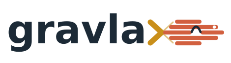

<p align="center">
  <picture>
    <source media="(prefers-color-scheme: dark)" srcset="assets/logo-dark.svg">
    
  </picture>
</p>

**Align once and query forever.** Gravlax turns a single-cell RNA-seq experiment into a compact, queryable archive of its molecules, so that quantification under any annotation, cohort-wide splicing queries, and discovery of unannotated features become fast queries rather than new pipelines.

## Why Gravlax

The artifact of a single-cell RNA-seq experiment that gets stored, shared, and reanalyzed is almost always the count matrix. But a count matrix is not an observation. It is the output of a computation with two inputs, the sequenced molecules and a gene annotation, and the two age very differently. The molecules are fixed on the day of sequencing; the annotation is revised several times a year. Moving a routine PBMC dataset from GENCODE v32 to v49 relocates about 2.4% of all UMI mass and changes the count of one expressed gene in five by more than 10%; in brain nuclei the same change moves nearly 5%. Once the matrix has been produced, none of that can be revisited. The evidence has been thrown away.

The alternative, keeping raw reads or alignments, preserves everything but is rarely exercised. FASTQ and BAM files for a single experiment occupy tens of gigabytes and a cohort occupies terabytes, so they move to cold storage and are reprocessed only when someone can afford to. Most of what they contain (sequences, base qualities, read names) is never read by the procedures that produce counts. Those procedures consume *relations* among molecules: which reads share splice geometry, which share a placement, which cell they belong to, and whether two UMIs are equal or one mismatch apart.

Gravlax stores exactly those relations, and nothing else, in an archive that is typically 30 to 50 times smaller than FASTQ and 9 to 13 times smaller than tag-preserving CRAM, at 11 to 18 bits per read. Every annotation-dependent decision (gene assignment, UMI collapse, transcript compatibility) is deferred until the archive is read. The archive can be kept beside the matrix indefinitely and re-read whenever the annotation, the question, or the cohort changes.

## What it does

1. **Align once, without an annotation.** Reads are aligned to the genome and barcodes are corrected once. Gravlax extracts molecular evidence from those alignments into a `.aie` archive without consulting a gene model.
2. **Replay any annotation.** Supplying a GTF at read time reproduces Gene, GeneFull, and Velocyto-style count matrices for that annotation. Replay takes seconds: 34 to 82 times faster than an annotation-aware STARsolo run at the same thread budget, and within 0.22 to 0.45% of UMI mass of it.
3. **Query the molecules directly.** Region, junction, splice-event, splice-graph, and 3′-site queries return per-cell or per-group molecule counts from indexed chunks in milliseconds, with or without an annotation.
4. **Federate across samples.** Archives compose into content-addressed collections that route a cohort query to the archives and chunks that can answer it. Answers are always computed from the source molecules; the collection is an index, never a second copy of the data.

Archives are seekable and content-authenticated. A root digest commits every section, so an operation verifies only the bytes it reads, and two archives that encode the same evidence can be recognized as such regardless of how they were packed.

## What it makes possible

Because the molecules are retained rather than the counts, Gravlax supports analyses that a count matrix cannot express and that raw reads make impractically expensive.

- **Requantify instead of reprocess.** Move a dataset, or a whole cohort, to a new GENCODE release in seconds. Replay two annotations side by side and get exact, signed count changes per gene and cell, with the molecular witnesses that caused them.
- **Ask splicing questions across a cohort.** Define cell groups once, then ask the same coordinate-defined question of every archive: junction support, cassette inclusion, alternative donor and acceptor usage, and molecular splice-path fragments, with sample-level statistics that never treat cells or molecules as replicates.
- **Find what the annotation misses.** Enumerate unannotated loci and splice events from the archive alone, then requantify them by ordinary replay. Atlas-wide reverse search finds junctions and splice patterns that recur across donors without supplying coordinates.
- **Study 3′ ends with a model that fits the assay.** Retained fragment boundaries support terminal-site analysis, including a cross-fitted mixture model for fragmented 10x 3′ libraries.
- **Recover ambiguous molecules.** Roughly 6% of countable molecules map to more than one gene and are dropped from conventional matrices. Pooling unambiguous evidence across cells recovers 91 to 98% of masked identities, emitted as an additive layer that leaves the base matrix untouched.
- **Share evidence, not just matrices.** An archive is small enough to distribute with a paper and complete enough that a reader can requantify or query it under their own annotation and their own questions.

## Install

```sh
cargo build --release
# binary: target/release/aie
```

Requires Rust 1.89 or later and a C toolchain (for zstd). Run `aie doctor` to check the installation.

## Quick start

Build an archive once from annotation-free alignments, then replay and query it as often as you like.

```sh
# 1. Align without a GTF (STAR two-pass, secondaries kept). Print the recipe:
aie ingest recipe --chemistry 10x-3p-v3

# 2. Build the archive:
aie ingest check align.bam --whitelist 3M-february-2018.txt --chemistry 10x-3p-v3
aie ingest-archive align.bam --whitelist 3M-february-2018.txt --out sample.aie

# 3. Replay any annotation:
aie compile-annotation gencode.v49.gtf --out gencode.v49.aic
aie replay-rows sample.aie --gtf gencode.v49.aic \
  --barcodes barcodes.tsv --out-dir counts/

# 4. Compare two annotations exactly:
aie compare-annotations sample.aie --annotation-a gencode.v44.gtf \
  --annotation-b gencode.v49.aic --assembly GRCh38.p14 \
  --annotation-a-label "GENCODE 44" --annotation-b-label "GENCODE 49"

# 5. Query the molecules:
aie query sample.aie region chr1:1000000-2000000 --format json
aie query sample.aie junction chr2:1234567-1250000 --format json
aie query sample.aie jset --include chr2:1234567-1250000 \
  --exclude chr2:1234567-1260000 --groups cell-types.tsv --format json
aie query sample.aie events chr2:1200000-1300000 \
  --groups cell-types.tsv --min-informative 10 --format json
aie query sample.aie discover --gtf gencode.v32.gtf --emit-gtf novel-loci.gtf

# 6. Work across samples:
aie collection build --sample A=a.aie --sample B=b.aie \
  --shape-routes --out atlas.aicollection
aie collection junction atlas.aicollection chr2:1234567-1250000 --format json
aie cohort events chr2:1200000-1300000 \
  --sample A=a.aie --sample B=b.aie --groups A=a-groups.tsv \
  --min-row-informative 10 --format json
aie cohort splice-graph chr2:1200000-1300000 \
  --design experiment.tsv --contrast control:treated --format json
```

Run `aie <command> --help` for the full option set of any subcommand.

## Going further

- **Run the live demonstrations.** Three one-click Google Colab notebooks reproduce annotation reinterpretation, coordinate-free multi-donor event discovery, and same-molecule evidence queries from the immutable [`demo-data-v1`](https://github.com/COMBINE-lab/gravlax/releases/tag/demo-data-v1) capsule. Start from the [demonstrations page](docs/src/content/docs/demos.md).
- **Projects and plans.** `aie project init` creates a workspace that registers inputs by stable name; versioned YAML or JSON plans are validated with `aie plan check`, resolved to a content-addressed snapshot, and resumed exactly. `aie explore` is a local, read-only plan builder that resolves gene and transcript identifiers and exports the plan as YAML, a command line, or Python. See the [workflow guide](docs/src/content/docs/workflow.md) and the small [demo project](examples/demo-project/README.md), which needs no dataset download.
- **Python and AnnData.** Query and cohort commands emit a shared JSON result contract that the Python client reads directly into AnnData. See [Python and AnnData](docs/src/content/docs/python.md).
- **Interchange.** `aie export-molecule-bam` writes the post-correction molecule abstraction as a tagged BAM for tools that cannot read `.aie`; the tag contract is documented in [`docs-notes/molecule-bam.md`](docs-notes/molecule-bam.md).
- **Formats.** The archive format is specified in [`docs-notes/format-spec.md`](docs-notes/format-spec.md) and the collection format in [`docs-notes/collection-index-spec.md`](docs-notes/collection-index-spec.md). Full command references live in [`docs/`](docs/src/content/docs/).

## Scope and limits

Gravlax makes the annotation-dependent part of quantification revisable; it does not make everything revisable. Genome alignment and barcode correction are performed once at ingest and are fixed thereafter. Read sequence and base qualities are not retained, so allele-specific, editing, and sequence-search questions are out of scope. Within a UMI class, reads that share a junction chain are stored as a count plus two coordinate-extreme representatives; this is exact for gene counting in our evaluations and measurably lossy for saturation-sensitive quantities such as the ambiguous component of RNA velocity. Cohort queries are fast, but they are not statistics: a design with biological replicates must be supplied, and Gravlax will not treat cells or molecules as replicates on your behalf.

## Repository layout

| Crate | Responsibility |
|---|---|
| `crates/evidence-io` | the `.aie` container: chunked streams, rANS and zstd coding, lazy open |
| `crates/ingest` | annotation-free BAM to molecular evidence: UMI classes and edges, shapes, placement patterns |
| `crates/anno` | GTF parsing and annotation compilation |
| `crates/aie` | the `aie` command-line tool: replay, query, cohort, and collection commands |

## Citation

A manuscript describing Gravlax is in preparation. This repository is the reference implementation.

## License

BSD 3-Clause. See [LICENSE](LICENSE).
